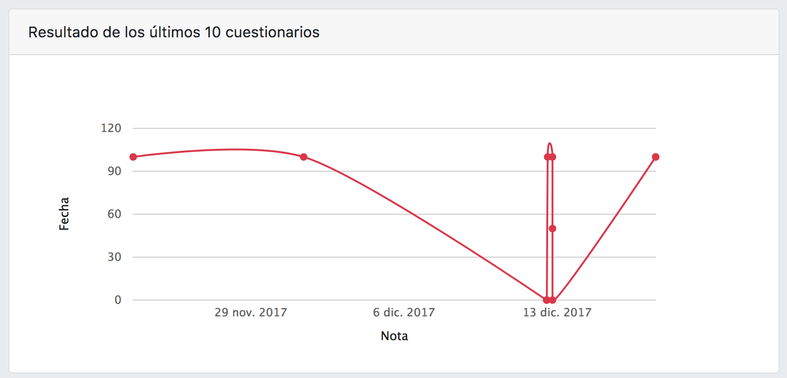
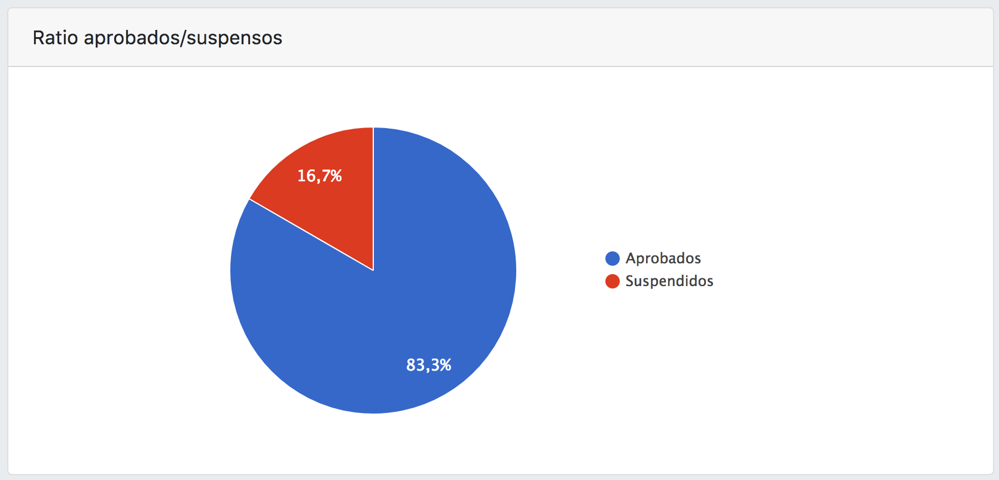

# Chartkick


Tal y como se puede ver en la caputra de pantalla de la página oficial de [Chartkick](https://www.chartkick.com/), se trata de un framework que permite crear estadísticas con JavaScript en solo una línea de Ruby.

## Usando Chartkick en RuQuiz

Para nuestro proyecto hemos utilizado **Chartkick** para crear las estadísticas tanto para los alumnos como para los profesores. 






En este caso la dinámica es bastante sencilla, ya que la documentación que aporta Chartkick deja muy claro como hacerlo.

1. Calculamos los datos en el controlador del servidor:

```ruby
    @last_10_prof_ind = Resultado.joins(:user,:cuestionario).where(cuestionario_id: cuestionario.id, cuestionarios: {creador: @user.name}).select("nota,fechares,notamaxima").limit(10)
    
    @area_chart_prof_ind = Hash.new
    @last_10_prof_ind.each do |nota|
        aux = (nota.nota * 100) / nota.notamaxima
        @area_chart_prof_ind[nota.fechares] = aux
    end
    
    @profesor_ind["line_chart"] = @area_chart_prof_ind
```

2. Insertar en la vista los datos que hemos obtenido:

```erb
    <div class="card-body">
    <%= line_chart(@area_chart_ind, colors: ["#dc3545"], xtitle: "Nota", ytitle: "Fecha") %>
    </div>
```


