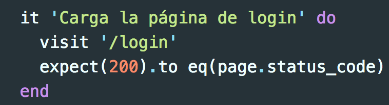
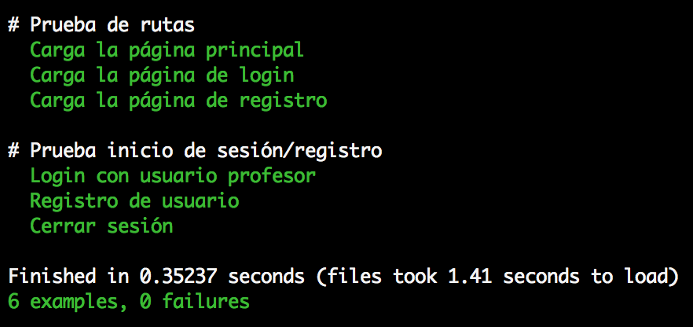
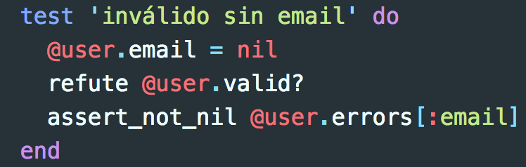
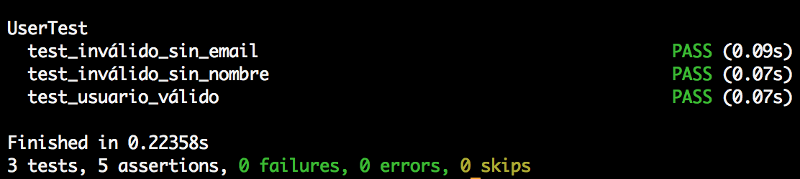

# Tests RuQuiz

En este proyecto los tests se encuentran en el directorio **./test**. Su estructura es la siguiente:

```
test/
├── acceptance
│   └── app_test.rb
├── models
│   └── user_test.rb
└── spec_helper.rb
```

En _spec_helper.rb_ se encuentra la configuración necesaria para los tests. Se especifica a RSpec las opciones deseadas y se cambia el entorno (enviroment) de la aplicación a "test".

## Tests de validación

En el directorio _test/acceptance/app_test.rb_ se encuentran las pruebas de validación. Estas pruebas son las encargadas de verificar que el software producido cumple con las especificaciones y logra su objetivo. Este tipo de pruebas son esenciales para verificar que lo que se ha desarrollado es lo que el usuario quería.

Para este apartado se ha usado el framework **Capybara**, ya que permite probar aplicaciones web simulando cómo un usario real interactuaría con la plataforma.

Un ejemplo para probar la ruta '/login' sería:



Un ejemplo para probar que el registro de usuarios es correcto sería:


Para ejecutar los tests de validación basta con escribir en la consola `$ rake acceptance` y la salida correcta sería:



## Test de modelos de la base de datos

Para probar el modelo de la base de datos correspondiente a los usuarios se ha usado **minitest**, un ligero y rápido framework para tests unitarios. Permite probar las condiciones del modelo y comprobar que se han definido correctamente, por ejemplo, que un usario no se pueda registrar en la base de datos con el campo de nombre vacío.

Un ejemplo para probar que un usuario no se puede registrar con el campo de email vacío sería:



Para ejecutar los tests de los modelos,sólo hay que escribir `$ rake models` y la salida correcta sería la siguiente:


