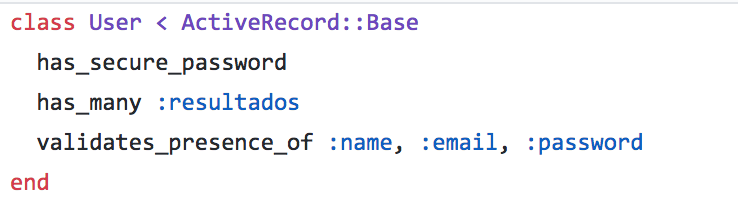
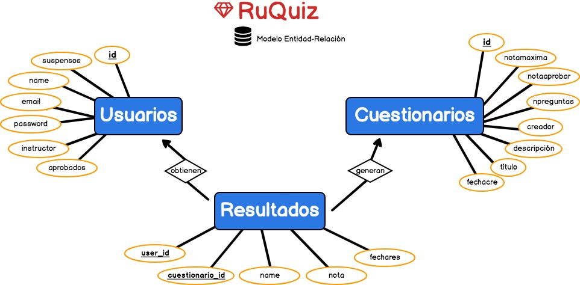

# Base de datos

Se ha optado por usar una base de datos relacional debido a la complejidad de la base de datos, las bases de datos no relacionales como mongodb no satisfacían todas nuestras necesidades. 

Elegimos SQLITE como sistema gestor de la base de datos, por su fácil integración con Sinatra. 

Al seguir el MVC, el modelo no podía estar escrito en SQL puro, por lo que se requiere de un ORM (Mapeo Objeto Relacional) para convertir datos entre el sistema de tipos utilizado en el lenguaje de programación orientado a objetos y la utilización de una base de datos relacional como motor de persistencia. 

Active Record fue nuestro ORM escogido, "que es la 'M' en el MVC", es decir, trata la información de la base de datos como objetos y clases para su fácil acceso. 

Por ejemplo en nuestro caso, la tabla 'Usuario':

```ruby
create_table "users", force: :cascade  do |t|
  t.string "name"
  t.string "email"
  t.string "password_digest"
  t.boolean "instructor"
  t.integer "suspensos"
  t.integer "aprobados"
end
```

Usando el ORM Active Record, vemos que trata la tabla User como una clase, que hereda de la clase base del propio ORM. Esa clase tiene una serie de especificaciones (la obligación de ciertos atributos, las relaciones con otras tablas, etc)




Las relaciones se especifican con el atributo `has_many`que sería relaciones uno a muchos en un modelo Entidad Relación. Para más información sobre las relaciones entre las tablas pinche [aquí](http://edgeguides.rubyonrails.org/association_basics.html)

Si queremos insertar información en la tabla, sería a través de instancias de la clases, como se puede ver en los controladores

```ruby
@user = User.new(name: params["name"], email: params["email"], password: params["password"])
```

Y si queremos acceder a esa información, basta con usar las variables asociadas a esa clase. 

```ruby
@user = User.last
```

Que en SQL sería el equivaliente:
```
SELECT * FROM users ORDER BY users.id DESC LIMIT 1
```

Para más información sobre las consultas en Active Record y su equivalencia en SQLITE visite la [guía](http://guides.rubyonrails.org/v2.3.8/active_record_querying.html)


### RuQuiz

